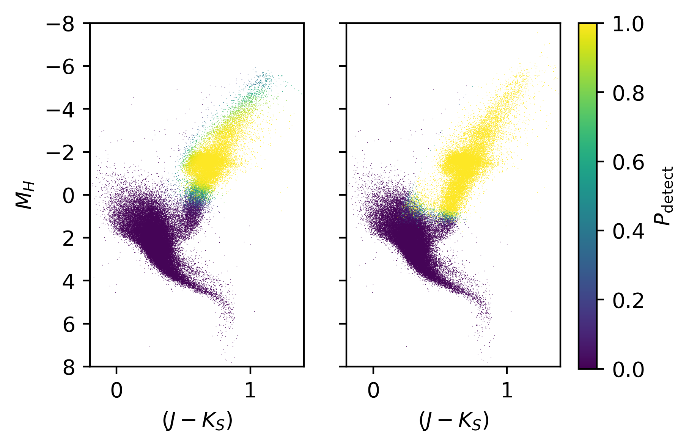
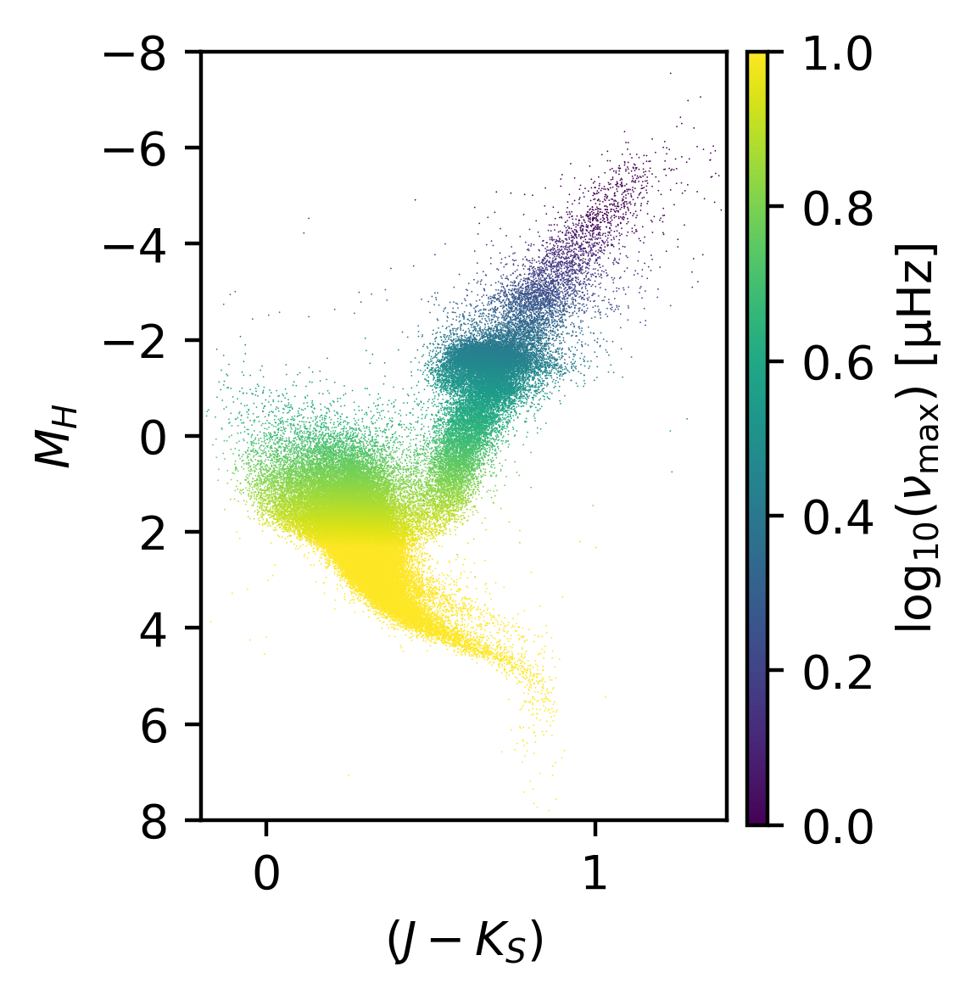
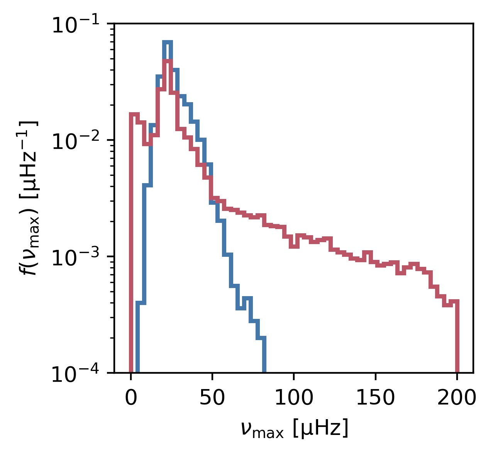

# asteroestimate
### python based detection probabilities and scaling relations for asteroseismology 

This module is intended to make it simple to estimate intrinsic stellar properties which are useful for asteroseismology (and other stellar astrophysics purposes) using simple observables. The main intention of the module is that it can be used for the estimation of the probability of asteroseismic detections in stars observed by long cadence photometric surveys using simple scaling relations and empirical relationships. To this end, it uses much of the theory and application outlined in [Chaplin et al. (2011)](https://ui.adsabs.harvard.edu/abs/2011ApJ...732...54C/abstract), and builds and borrows from available code from [Mathew Schofield's ATL](https://github.com/MathewSchofield/ATL_public/blob/master/ATL/DR.py) and the [code used in generating the Tess Input Catalogue](https://github.com/tessgi/ticgen).

#### Prerequisites

The main module currently only requires that the usual Scipy stack is installed (e.g. [`scipy`](https://github.com/scipy/scipy), [`numpy`](https://github.com/numpy/numpy), [`matplotlib`](https://github.com/matplotlib/matplotlib)). However, note that to run the examples below you will also need to install Jo Bovy's [`gaia_tools`](https://github.com/jobovy/gaia_tools) module.

#### Installation

while `asteroestimate` is under development, to install, please use 
```
git clone https://github.com/jmackereth/asteroestimate.git
cd asteroestimate
python setup.py install
```

## Examples

The following demonstrate some of the main use-cases for the package

### Comparing Kepler and TESS detections as a function of colour and magnitude
A good example of where this module is useful is in comparing how probable it is that a star or stellar population will have detectable oscillations based on light curves from different high-cadence photometric surveys. In this example, we will select some stars from Gaia in the rough location of the Kepler field and look at how the detection statistics differ between Kepler and TESS.

First, lets use `gaia_tools` to grab some Gaia and 2MASS photometry in the Kepler field...
```python
import numpy as np
import matplotlib.pyplot as plt
from asteroestimate.detections import probability
from gaia_tools import query

test_query = """
SELECT *
FROM gaiadr2.gaia_source AS gaia
INNER JOIN gaiadr2.tmass_best_neighbour AS tmass_match ON tmass_match.source_id = gaia.source_id
INNER JOIN gaiadr1.tmass_original_valid AS tmass ON tmass.tmass_oid = tmass_match.tmass_oid
WHERE 1=CONTAINS(
  POINT('ICRS',gaia.ra,gaia.dec),
  CIRCLE('ICRS',90,-66.56070889, 20))
AND gaia.phot_g_mean_mag>=1 AND gaia.phot_g_mean_mag<11
AND gaia.parallax/gaia.parallax_error >= 20
"""
data = query.query(test_query)

G, BP, RP, J, H, K, parallax = data['phot_g_mean_mag'],  data['phot_bp_mean_mag'], data['phot_rp_mean_mag'], data['j_m'], data['h_m'], data['ks_m'], data['parallax']
```
now we'll use the `from_phot` function in the `probability` module to get the estimated detection probabilities for each star in the dataset above. Since we dont know the mass of each star (this is why we need asteroseismology!), we will have to take a guess at the mass for this estimate. The default is to assume each star has a mass of 1 Msun (`mass = 1.`) - this is of course, ridiculous, so `asteroestimate` has a number of possible options here:
* Keep this constant for all input objects by passing a single float to `mass=`
* Provide an array of samples from a prior on mass for each object in the catalogue, with a shape `(len(data), len(samples))`. This could be, e.g. based on sampling from stellar evolution models
* Use an 'in-built' prior on mass for a given population (at the moment only 'giants' is available, and is _extremely_ naive and basic!).

For this example, we will simply assume a mass of 0.9 Msun... We can also include here an estimate of the extinction toward the stars by providing the `AK=` keyword. At present, this is the K band extinction. 

Furthermore, we will include here the length of the observations (in days) via the `T=` keyword. In our example, we assume a single TESS sector (27 days) and the full 4 year Kepler-Prime time series. We indicate the observation mode using the `obs=` keyword. This indicates the telescope and the cadence mode e.g. `'tess-ffi'` is the Full Frame Images (30min. cadence) from TESS. You can see the implemented observing mode using `probability.obs_available`.

The final call for our examples are as follows:
```python
tessprob = probability.from_phot(G, BP, RP, J, H, K, parallax, mass=0.9, T=27., obs='tess-ffi')
keplerprob = probability.from_phot(G, BP, RP, J, H, K, parallax, mass=0.9, T=365.*4., obs='kepler-lc')
```

the arrays `tessprob` and `keplerprob` now contain the probability of detecting seismic oscillations for each star in the input. We can plot this up on a CMD to look at the characteristics of each set of observations:
```python
fig, ax= plt.subplots(1,2, sharex=True, sharey=True)
ax[0].scatter(J-K, H-(5*np.log10(1000/parallax)-5), s=0.1, c=tessprob, vmin=0., vmax=1.)
ax[0].set_xlim(-0.2,1.4)
ax[0].set_ylim(8,-8)
s = ax[1].scatter(J-K, H-(5*np.log10(1000/parallax)-5), s=0.1, c=keplerprob, vmin=0., vmax=1.)
ax[1].set_xlim(-0.2,1.4)
ax[1].set_ylim(8,-8)

for axis in ax:
    axis.set_xlabel(r'$(J-K_S)$')
    
ax[0].set_ylabel(r'$M_{H}$')

fig.subplots_adjust(right=0.9)
cax = fig.add_axes([0.93,0.12,0.03,0.76])
plt.colorbar(s, label=r'$P_{\mathrm{detect}}$', cax=cax)
```
which will produce the following figure:



We can see that TESS (on the left) has a quite constrained range of intrinsic brightness where oscillations will be detected. Kepler, on the other hand, does very well for bright giants, extending right down the RGB! Note that this is highly simplistic, however, as we havent adjusted for extinction at all in making our predictions.

We can also look at the expected nu max for the stars by computing it using `numax_from_JHK`, which will use the same scaling relations to estimate nu_max from the 2MASS photometry:
```python
numax = probability.numax_from_JHK(J, H, K, parallax, mass=0.9)

fig = plt.figure()
fig.set_size_inches(2,3)
plt.scatter(J-K, H-(5*np.log10(1000/parallax)-5), s=0.1, lw=0.,c=np.log10(numax), vmin=0., vmax=3)
plt.xlim(-0.2,1.4)
plt.ylim(8,-8)


plt.xlabel(r'$(J-K_S)$')
    
plt.ylabel(r'$M_{H}$')

fig.subplots_adjust(right=0.9)
cax = fig.add_axes([0.93,0.12,0.03,0.76])
plt.colorbar(s, label=r'$\log_{10}(\nu_{\mathrm{max}})\ \mathrm{[\mu Hz]}$', cax=cax)
```
through which we will get the following figure:



Combining this function with the detection probability is quite useful for determining the estimated range in nu max where detections can be made:
```python
fig = plt.figure()
fig.set_size_inches(3,3)
tessdetect = tessprob >= 0.9999
keplerdetect = keplerprob >= 0.9999

bins = np.linspace(0.,200.,50)
plt.hist(numax[tessdetect], density=True, bins=bins, histtype='step', lw=2., color='#4477AA', log=True, label='TESS-FFI')
plt.hist(numax[keplerdetect], density=True, bins=bins, histtype='step', lw=2., color='#BB5566', log=True, label='Kepler-LC')
plt.ylim(1e-4,1e-1)
plt.xlabel(r'$\nu_\mathrm{max}\ \mathrm{[\mu Hz]}$')
plt.ylabel(r'$f(\nu_\mathrm{max})\ \mathrm{[\mu Hz^{-1}]}$')
```
generating the distributions:



Now we can clearly see that Kepler long cadence can detect quite a lot more higher nu max giants than TESS-FFI (because of it's better noise properties). However, note that this is likely not a good representation of the Kepler asteroseismic samples, which have a significantly different photometric selections!
